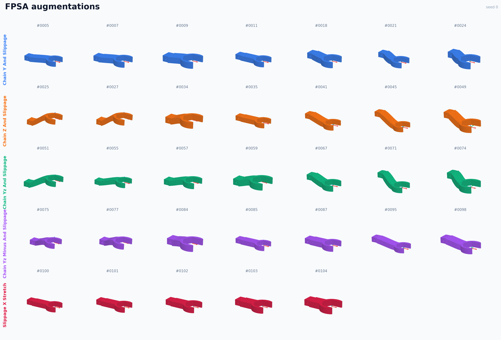
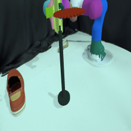
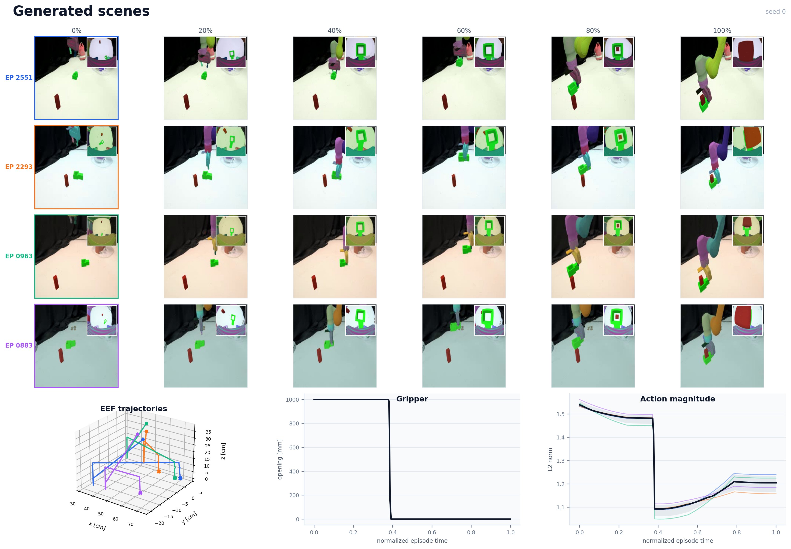

# Function-Preserving Data Generation for Zero-Shot Real-to-Sim-to-Real Manipulation

[](https://arxiv.org/abs/2609.18293)
[](https://fpsa-r2s2r.github.io/)
[](#installation)

Official implementation of **Function-Preserving Data Generation for Zero-Shot Real-to-Sim-to-Real Manipulation**.

FPSA is a Real-to-Sim-to-Real framework for generating geometrically diverse, physically valid demonstrations for contact-rich robot manipulation. It deforms reconstructed object meshes while preserving task-critical interfaces, transfers task poses and collision proxies through the retained mesh correspondence, and combines the resulting assets with visual and calibration domain randomization. Policies are trained entirely on synthetic demonstrations and deployed in the real world without real-world fine-tuning.

The paper evaluates four tasks—object pick-up, wrench-based screw fastening, assembly, and single-gear extraction.

**Links:** [paper](https://arxiv.org/abs/2609.18293) · [project page](https://fpsa-r2s2r.github.io/) · [FPSA module documentation](FPSA/README.md)


## Highlights

- Generates synthetic demonstrations directly from reconstructed assets, without teleoperated source trajectories.
- Combines slippage-preserving reshaping for stretching with as-rigid-as-possible (ARAP) deformation for bending.
- Preserves annotated functional regions and mesh topology, then transfers grasp/tool poses and convex collision proxies consistently.
- Runs parallel PyBullet environments with GPU-accelerated OpenGL rendering and extensive visual, geometric, and calibration randomization.
- Includes task-specific scripted experts, data conversion, Diffusion Policy training, simulation evaluation, and Franka deployment code.

## Repository layout

```text
FPSA/                   Function-preserving mesh augmentation and batch randomizers
sim_world/              PyBullet tasks, scripted experts, and domain randomization
diffusion_policy/       Policy datasets, models, workspaces, and environment runners
data/                   Robot, scene, object, and example augmented assets
franka_standalone/      Franka/Polymetis client-server utilities
MP_collectdata.py       Parallel synthetic demonstration collection
MP_replaydata.py        Collected-episode to Zarr conversion
train.py                Hydra entry point for policy training
eval.py                 Checkpoint evaluation entry point
franka_deploy_*.py      Real-robot deployment entry points
```

## Tested configuration

The release has been tested on Linux x86-64 with Python 3.9, an NVIDIA GeForce RTX 5080 (16 GB), CUDA 12.8, PyTorch 2.8.0, and PyBullet 3.2.7. The prebuilt slippage-reshaping wheel is specific to CPython 3.9 on Linux x86-64. Other platforms can build that binding from source.

GPU rendering requires a working host NVIDIA driver and EGL/OpenGL installation. The CUDA toolkit and NVIDIA driver are not bundled with this repository.

## Installation

Clone the repository with its submodules:

```bash
git clone --recurse-submodules https://github.com/FPSA-r2s2r/FPSA-r2s2r.git
cd FPSA-r2s2r
```

If the repository was cloned without submodules:

```bash
git submodule sync --recursive
git submodule update --init --recursive
```

Create the tested Python environment and install the CUDA 12.8 PyTorch wheels:

```bash
conda create -n PhyDomain python=3.9 -y
conda activate PhyDomain

conda install cuda -c nvidia/label/cuda-12.8.0
pip install torch==2.8.0 torchvision==0.23.0 torchaudio==2.8.0 --index-url https://download.pytorch.org/whl/cu128
```

Install the project dependencies. `DP_requirements.txt` includes `requirements.txt`; use only the first command if you need FPSA and simulation without policy training.

```bash
# FPSA, asset generation, and simulation only
python -m pip install -r requirements.txt

# Additional dependencies for data conversion and Diffusion Policy training
python -m pip install -r DP_requirements.txt
```

### Build the patched PyBullet EGL renderer

The local [pybullet-egl-patch](pybullet-egl-patch/README.md) fixes dynamic texture replacement in PyBullet's EGL renderer. Building it requires Git, GNU Make, a C++ compiler, and a working EGL/OpenGL driver.

```bash
conda activate PhyDomain
cd pybullet-egl-patch
./scripts/build_plugin.sh --python "$(which python)"
python -m pip install -e .
cd ..
```

The build runs the renderer smoke tests automatically. Because the plugin exchanges private Bullet C++ objects with `pybullet.so`, rebuild it in the environment that will run the simulations.

### Install the slippage-preserving reshaping binding

The submodule includes a prebuilt CPython 3.9/Linux x86-64 wheel:

```bash
python -m pip install --force-reinstall --no-deps \
  FPSA/slippage-preserving-reshaping/slippage_reshaping_wheel_packager/dist/slippage_reshaping-0.1.0-cp39-cp39-linux_x86_64.whl
```

To rebuild the binding and wheel on Linux (Optional):

```bash
python -m pip install pybind11 build wheel setuptools
cmake -S . -B build_py -DCMAKE_BUILD_TYPE=Release \
  -DPython3_EXECUTABLE="$(which python)"
cmake --build build_py --target slippage_reshaping_cpp -j$(nproc)
bash slippage_reshaping_wheel_packager/prepare_and_build_wheel.sh
```

Set the repository root on `PYTHONPATH` before running the examples:

```bash
export PYTHONPATH="$PWD${PYTHONPATH:+:$PYTHONPATH}"
```

## Task and configuration lookup

| Task | FPSA asset config | Simulation config | Policy task config | Cameras | Training workspace |
|---|---|---|---|---|---|
| Pick-up | [`bracket_meta.yaml`](FPSA/configs/bracket/bracket_meta.yaml) | [`Config_PickUp.yaml`](sim_world/Config_PickUp.yaml) | [`FPSA_PickUp.yaml`](diffusion_policy/config/task/FPSA_PickUp.yaml) | eye-on-base | [`FPSA_AgentOnly_workspace.yaml`](diffusion_policy/config/FPSA_AgentOnly_workspace.yaml) |
| Screw fastening | [`wrench_meta.yaml`](FPSA/configs/wrench/wrench_meta.yaml) | [`Config_Wrench.yaml`](sim_world/Config_Wrench.yaml) | [`FPSA_Wrench.yaml`](diffusion_policy/config/task/FPSA_Wrench.yaml) | eye-on-base + wrist | [`FPSA_FishEye_workspace.yaml`](diffusion_policy/config/FPSA_FishEye_workspace.yaml) |
| Assembly | [`assembly_meta.yaml`](FPSA/configs/assembly/assembly_meta.yaml) | [`Config_Assembly.yaml`](sim_world/Config_Assembly.yaml) | [`FPSA_Assembly.yaml`](diffusion_policy/config/task/FPSA_Assembly.yaml) | eye-on-base + wrist | [`FPSA_FishEye_workspace.yaml`](diffusion_policy/config/FPSA_FishEye_workspace.yaml) |
| Gear extraction | [`gear_meta.yaml`](FPSA/configs/gear/gear_meta.yaml) | [`Config_Gear.yaml`](sim_world/Config_Gear.yaml) | [`FPSA_Gear.yaml`](diffusion_policy/config/task/FPSA_Gear.yaml) | eye-on-base + wrist | [`FPSA_FishEye_workspace.yaml`](diffusion_policy/config/FPSA_FishEye_workspace.yaml) |

## End-to-end usage

### 1. Generate function-preserving assets

The grasp-based randomizer transfers the initial grasp and collision proxy:

```bash
python FPSA/grasp_randomizer.py \
  --meta FPSA/configs/assembly/assembly_meta.yaml
```

The tool randomizer transfers the wrench frame, resets the output mesh to that frame, and writes the wrench-to-TCP transform:

```bash
python FPSA/tool_randomizer.py \
  --meta FPSA/configs/wrench/wrench_meta.yaml
```

See [FPSA/README.md](FPSA/README.md) for all supplied configurations, output files, sampling semantics, and custom-object instructions.

Visualize the augmented objects through MeshLab or our script:

```
python visualize_augmented_objects.py   --root ./data/objects/wrench/fpsa_aug_outputs   --samples-per-label 7
```




### 2. Configure and preview a simulation task

Each `sim_world/Config_*.yaml` file contains the asset paths, randomization ranges, collection settings, and output directory for one task. Before collection:

1. Change `mp_collect.output_root` to a writable location.
2. Change `make_scene.distractor_root` to your Google Scanned Objects directory ([GSO dataset](https://huggingface.co/datasets/suvadityamuk/google-scanned-objects)), or set `make_scene.randomize_distractors: false`.
3. Reduce `mp_collect.num_processes` if GPU memory is limited. The supplied value of 10 was tested with 16 GB VRAM.

Run a single-process GPU-rendered preview:

```bash
python demo.py sim_world/Config_Gear.yaml
```

The running pictures is saved online at [temp_agentview](temp_agentview.png) and [temp_fisheye](temp_fisheye.png).



### 3. Generate synthetic demonstrations

The paper uses 3,000 synthetic episodes per task:

```bash
python MP_collectdata.py sim_world/Config_Assembly.yaml \
  --num-episodes 3000 \
  --num-processes 10
```

Collection settings can be overridden on the command line. Use `--resume` to continue the most recent run under the configured `output_root`; incomplete episode directories are detected and regenerated. The collector periodically restarts workers according to `mp_collect.restart_every` to bound long-running renderer memory growth.

Visualize the generated scenes through any media player or our script:

```
python visualize_scenes.py --root /path/to/collection/run --episodes 4 --frames 6 --camera both
```



### 4. Convert episodes to a Diffusion Policy replay buffer

```bash
python MP_replaydata.py \
  --data_root /path/to/collection/run \
  --out_path ./data/DP_data/Assembly/FPSA_Assembly.zarr \
  --use_eye_in_hand \
  --num_workers 1
```

`data_root` must be the run directory that contains `episodes/`. Use `--no-use_eye_in_hand` for the pick-up task. Video decoding is memory-intensive; start with one worker and increase gradually if sufficient RAM is available.

### 5. Train a policy

We use Diffusion Policy as a deliberately simple, data-driven test bed. Unlike pretrained policies such as π0 or π0.5, it introduces no large-scale vision-language-action prior, so its behavior more directly reflects the demonstrations on which it is trained. Our data generation method is policy-agnostic, and we expect stronger pretrained policies to benefit from the same data as well, although that evaluation is beyond the present scope.

Update `dataset_path` in the selected file under [`diffusion_policy/config/task/`](diffusion_policy/config/task/) so it points to the converted Zarr dataset. Then choose the workspace that matches the observation setup:

```bash
# Eye-on-base camera only (default task: FPSA_PickUp)
python train.py --config-name=FPSA_AgentOnly_workspace

# Eye-on-base and wrist cameras (select a task explicitly)
python train.py --config-name=FPSA_FishEye_workspace task=FPSA_Assembly
python train.py --config-name=FPSA_FishEye_workspace task=FPSA_Wrench
python train.py --config-name=FPSA_FishEye_workspace task=FPSA_Gear
python train.py --config-name=FPSA_FishEye_workspace task=FPSA_GearHorizon
```

Training outputs and checkpoints are written under `data/outputs/`. The provided workspaces use Weights & Biases online logging; append `logging.mode=offline` if an online account is unavailable. Batch size, rollout environment count, and dataloader workers are tuned for the tested 16 GB system and may need to be reduced on smaller machines.

Training includes online simulation validation through the configured environment runner, using held-out seeds that are separate from training-data generation. The Gym-compatible task environments are in [`sim_world/Env_*.py`](sim_world/), and their training-loop runners are in [`diffusion_policy/env_runner/FPSA_*_runner.py`](diffusion_policy/env_runner/).

### 6. Real-world deployment

Real-robot deployment uses [Polymetis](https://github.com/facebookresearch/polymetis). Configure robot and camera addresses in [`franka_standalone/config.py`](franka_standalone/config.py) and follow the two-machine setup in [`franka_standalone/README.md`](franka_standalone/README.md) before running a deployment script.

```bash
python franka_deploy_wristCam.py \
  -c /path/to/latest.ckpt \
  -o ./data/real_deploy \
  --camera_setup both
```

Use `python franka_deploy_wristCam.py --help` for all runtime options and safety controls. Deployment is hardware-specific: recalibrate camera intrinsics/extrinsics, verify the workspace transform, and validate motions at low speed before operating a physical robot.

## Reproducing the paper setup

- All policies in the paper are trained exclusively on 3,000 synthetic episodes per task.
- Policy observations are 224 × 224 RGB images plus end-effector position and quaternion orientation.
- Simulation comparisons use 50 held-out environments generated from seeds excluded from training-data generation.
- Pick-up uses the eye-on-base camera; the contact-rich tasks additionally use the wrist fisheye camera.

Exact asset paths and randomization settings are defined in the checked-in YAML files rather than duplicated in this README.

## Tests

Run the CPU-compatible dataset, policy, workspace, and environment-runner regression tests with:

```bash
python tests/test_fpsa_memory.py
```

The PyBullet EGL plugin has its own texture-replacement and Panda URDF smoke tests; they run automatically during `build_plugin.sh` and can also be invoked from [`pybullet-egl-patch`](pybullet-egl-patch/README.md#tests).

## Citation

If this repository is useful in your research, please cite:

```bibtex
@article{xiang2026function,
  title   = {Function-Preserving Data Generation for Zero-Shot Real-to-Sim-to-Real Manipulation},
  author  = {Xiang, Tianyi and Xie, Xupeng and Cao, Jiahang and Luo, Andrew F. and Li, Haoang and Ma, Jun},
  journal = {arXiv preprint arXiv:2609.18293},
  year    = {2026}
}
```

